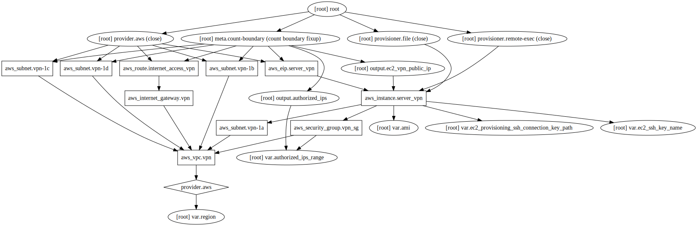

# Terraform vpn setup for AWS

[](https://travis-ci.com/GabLeRoux/terraform-aws-vpn)

Create a vpn server on AWS in its own vpc using terraform



<!-- START doctoc generated TOC please keep comment here to allow auto update -->
<!-- DON'T EDIT THIS SECTION, INSTEAD RE-RUN doctoc TO UPDATE -->
**Table of Contents**

- [Getting Started](#getting-started)
  - [Requirements](#requirements)
  - [Related documentation](#related-documentation)
  - [Set your secrets in dotenv files](#set-your-secrets-in-dotenv-files)
  - [Load your aws profile](#load-your-aws-profile)
  - [Init terraform](#init-terraform)
  - [See what's going to be applied](#see-whats-going-to-be-applied)
  - [Apply the changes](#apply-the-changes)
- [FAQ and Considerations](#faq-and-considerations)
  - [How much does it cost?](#how-much-does-it-cost)
  - [Should I stop the instance to save money?](#should-i-stop-the-instance-to-save-money)
  - [Can I use a variable to not use an Elastic IP?](#can-i-use-a-variable-to-not-use-an-elastic-ip)
  - [How much time does it take to provision all of this?](#how-much-time-does-it-take-to-provision-all-of-this)
  - [How can I stop and start my instance from command line](#how-can-i-stop-and-start-my-instance-from-command-line)
  - [How much time does it take for the vpn to start when I start the instance?](#how-much-time-does-it-take-for-the-vpn-to-start-when-i-start-the-instance)
  - [Will the credentials be the same each time?](#will-the-credentials-be-the-same-each-time)
  - [Will this work from everywhere?](#will-this-work-from-everywhere)
  - [Will I be invisible on the internets?](#will-i-be-invisible-on-the-internets)
  - [Troubleshooting terraform](#troubleshooting-terraform)
  - [What can I do to improve this project?](#what-can-i-do-to-improve-this-project)
- [Development](#development)
  - [Generate a graph of the plan](#generate-a-graph-of-the-plan)
  - [Update table of content](#update-table-of-content)
- [License](#license)

<!-- END doctoc generated TOC please keep comment here to allow auto update -->


## Getting Started

### Requirements

* The amazing [`jq`](https://stedolan.github.io/jq/) command line
* The `awscli` configured with your [`aws profile`](https://docs.aws.amazon.com/cli/latest/userguide/cli-multiple-profiles.html).

### Related documentation

* [Terraform documentation](https://www.terraform.io/docs/)
* [How to install terraform](https://www.terraform.io/intro/getting-started/install.html)
* [Setup awscli profile using env vars](https://www.terraform.io/docs/providers/aws/index.html#environment-variables)
* [Setup VPN clients](https://git.io/vpnclients)
* [VPN Important notes](https://git.io/vpnnotes)
* [The VPN Install script](https://git.io/vpnsetup)

### Set your secrets in dotenv files

```bash
cp .env.example .env
cp .env.vpn.example .env.vpn
```

Then edit `.env` and `.env.vpn` to fit your needs

### Load your aws profile

I like to use the following function to quickly load environment variables:

```bash
function loadenv() {
    export $(cat ${$1:-.env} | xargs)
}
loadenv
```

In our case, this will `export` the `AWS_PROFILE` to the one defined in `.env`. :+1:

### Init terraform

```bash
terraform init
```

### See what's going to be applied

```bash
terraform plan
```

### Apply the changes

```bash
terraform apply
```

Write `yes` in the prompt if you're fine with this. Wait a few minutes and that's it, configure your vpn client and you're good to go! :tada:. 

## FAQ and Considerations

### How much does it cost?

It depends of your usage. AWS offers a free tier and if you only use what's inside, it shouldn't cost you anything when using a `t2.micro` instance.

### Should I stop the instance to save money?

If you're like me and have a bunch of instances running, you're passed the free tier so yes, stopping the instance will save you money when not using it. Caution tho, Elastic IPs are billed when attached to a stopped instance so you may want to detach it and delete it otherwise it will cost you 0.01$/h.

### Can I use a variable to not use an Elastic IP?

Contributions are welcome :v:, see [#1](https://github.com/GabLeRoux/terraform-aws-vpn/issues/1), workaround inside.

### How much time does it take to provision all of this?

I don't have exact numbers, but it took me ~7 minutes to run including vpn script execution on the first time. Once this is done, there is no more delays.

### How can I stop and start my instance from command line

```bash
export AWS_PROFILE=your_awesome_aws_profile
./scripts/vpn_stop.sh
./scripts/vpn_start.sh
./scripts/vpn_status.sh
```

The status script will display instance's public IP for convenience. Just run the script until it says soomething like that before you try to connect:

```json
[
  {
    "state": "running",
    "PublicIpAddress": "aaa.bbb.ccc.ddd",
    "PublicDnsName": "ec2-aaa-bbb-ccc-ddd.your-region-1.compute.amazonaws.com"
  }
]
```

:tada:

### How much time does it take for the vpn to start when I start the instance?

A few seconds

### Will the credentials be the same each time?

Yes, unless you've set empty values in `.env.vpn`, but creds are generated at provision (install) time.

### Will this work from everywhere?

Tricky question.

* For the initial setup, you will require ssh port open. Some internet cafes or business firewalls have this blocked. But once it's installed, all you need is udp ports 500 and 4500 open. You should be able to stop and start the vpn from the scripts without these.
* If you're in china, it may be harder. Have a look to the available aws regions and pick the right one for you, there's a variable for this.

### Will I be invisible on the internets?

No, you're never invisible on the internets. Don't do bad things cuz Illuminatis are confirmed /o\. Glad you made it this far in the readme! :neckbeard:

### Troubleshooting terraform

In case you get an unclear error message

```bash
TF_LOG=TRACE terraform your_command
``` 

### What can I do to improve this project?

Have a look at [the issues](https://github.com/gableroux/terraform-aws-vpn/issues), suggest things or contribute, I'm open to changes.

## Development

### Generate a graph of the plan

```bash
terraform graph -draw-cycles | dot -Tsvg -o graph.svg
```

### Update table of content

generated with [DocToc](https://github.com/thlorenz/doctoc)

```bash
doctoc --github ReadMe.md
```

## License

[MIT](LICENSE.md) © [Gabriel Le Breton](https://gableroux.com)
